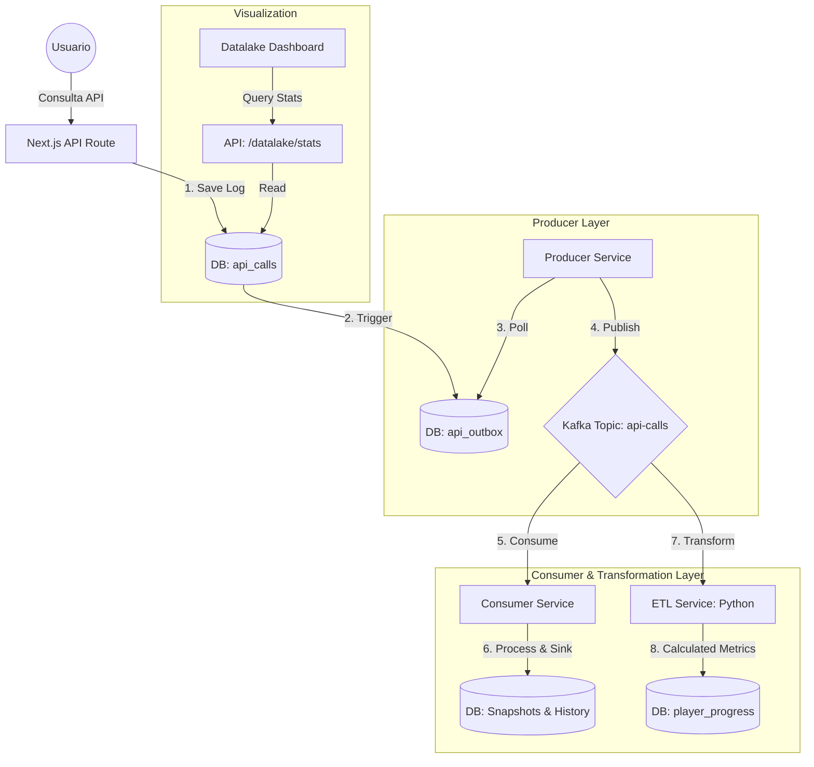

# Arquitectura de Datos: Miyu Tracker (Kappa & Outbox)

Este documento explica el flujo de datos y la función de cada componente en la arquitectura de ingeniería de datos del proyecto.

## Diagrama de Flujo

## Componentes y su Función

### 1. Next.js API Routes (`src/app/api/osirion/route.ts`)
Es el punto de entrada. Cuando un usuario busca un jugador o ve la tienda:
- Consulta la API externa (Osirion, Fortnite API, etc.).
- Gestiona el **Cache-Aside**: Si los datos están en PostgreSQL y no han expirado, los devuelve de inmediato.
- **Registro**: Guarda los metadatos de la llamada en la tabla `api_calls`.

### 2. Tabla Outbox (`api_outbox`) y Trigger
Implementamos el **Outbox Pattern** para garantizar que ningún evento se pierda:
- Un **Trigger SQL** (`fn_api_call_to_outbox`) se dispara automáticamente cada vez que se inserta una fila en `api_calls`.
- Este trigger copia los datos necesarios a la tabla `api_outbox`.
- Esto desacopla la aplicación web de la disponibilidad de Kafka.

### 3. Producer Service (`producer/index.ts`)
Un microservicio independiente que:
- Monitorea constantemente la tabla `api_outbox`.
- Cuando encuentra eventos nuevos (`published = FALSE`), los envía a Kafka.
- Tras confirmar que Kafka recibió el mensaje, marca el evento como publicado.

### 4. Apache Kafka (Topic: `api-calls`)
Es nuestro **Message Broker**. Actúa como un log inmutable de todos los eventos que ocurren en el sistema. Permite que múltiples consumidores procesen los datos de forma asíncrona.

### 5. Consumer Service (`consumer/index.ts`)
Es el motor de persistencia:
- Lee los mensajes de Kafka.
- **Persistencia**: Guarda el registro en el Data Lake histórico.
- **Extracción**: Crea snapshots de jugadores y registros de tienda.

### 6. ETL Service (`etl/transform.py` - Python)
Es la capa de inteligencia y transformación:
- Consume eventos de estadísticas de Kafka.
- **Transformación**: Compara los datos actuales con los históricos del usuario.
- **Cálculo de Mejoras**: Calcula deltas (diferencias) en KD, Win Rate y otras métricas.
- **Persistencia Analítica**: Guarda los resultados procesados en la tabla `player_progress`, que se usa para generar gráficos de mejora.

### 7. Dashboard de Monitoreo (`src/app/dashboard/datalake/page.tsx`)
Una interfaz premium que consume la API de estadísticas para mostrar:
- Volumen de datos capturados.
- Salud del sistema (tasa de errores).
- Latencia de las APIs externas.
- Tráfico en tiempo real.

## ¿Por qué esta arquitectura?
- **Resiliencia**: Si Kafka o la base de datos caen temporalmente, el sistema sigue funcionando y los datos se procesan cuando los servicios vuelven a estar en línea.
- **Escalabilidad**: Podemos añadir más consumidores para procesar datos de diferentes maneras sin afectar el rendimiento de la aplicación principal.
- **Análisis Histórico**: No solo vemos el "ahora", sino que guardamos snapshots para ver cómo evolucionan las estadísticas de los jugadores con el tiempo.
